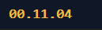

<div align="center">


# NineTick

### A native Windows corner timer that starts counting immediately

NineTick gives you a fixed, always-on-top elapsed timer with lightweight tray controls and no application runtime to install.

[Source code](https://github.com/LecyLecy/NineTick) · [Windows only](#run-locally)

</div>

## Overview

NineTick is a small Win32 desktop utility for tracking elapsed time from the
moment it starts. It begins at `00.00.00`, updates the visible value once per
second, and continues counting upward. The overlay defaults to the lower-right
corner of the primary display.

The application intentionally uses the Windows API directly instead of a UI
framework. This keeps the executable small, avoids a packaged application
runtime, and limits work while idle to a 250 ms Windows timer that repaints only
when the displayed second changes.

## Application Preview



## Key Features

- Starts counting immediately on launch, beginning at `00.00.00`.
- Remains always on top and cannot be moved by dragging.
- Starts in the lower-right corner, with top-left, top-right, and bottom-left
  alternatives available from the tray menu.
- Persists the selected corner for the current Windows user.
- Adds itself to the current user's Windows startup registry entry on first
  launch. The tray menu can turn this setting off.
- Provides tray actions to reset the timer, change the corner, toggle startup,
  and quit the application.
- Uses a single-instance lock, so a second launch does not create another
  overlay.

## How It Works

At startup, NineTick reads the saved corner from the current user's registry
settings, records the current Windows tick count, and creates a borderless,
topmost overlay. A Windows timer checks the elapsed time every 250 ms. When a
new whole second is reached, the overlay paints `HH.MM.SS` using a fixed-width
font.

The notification-area icon is the control surface. Its menu resets the start
time, changes the stored corner, toggles the Windows `Run` registry value, or
closes the application cleanly.

## Technical Architecture

The codebase is deliberately compact:

- `NineTick.cpp` contains the Win32 window procedure, timing, notification-area
  menu, single-instance guard, and Registry persistence.
- `NineTick.rc` embeds the generated `.ico` application icon in the executable.
- `build.ps1` compiles the native executable with MinGW and regenerates the
  local test shortcut.

Using `WS_POPUP` removes normal window chrome. `WS_EX_TOPMOST` keeps the
overlay above ordinary windows, while handling `WM_NCHITTEST` as client content
prevents drag-based repositioning. The project uses the Windows Registry rather
than a configuration dependency because only one small setting, the chosen
corner, needs persistence.

## Technology

| Area | Tools |
| --- | --- |
| Interface and system integration | C++17, Win32 API, Windows Shell notification area |
| Build | MinGW `g++`, `windres`, PowerShell |
| State | Windows Registry, current user scope |
| Assets | Embedded `.ico`, PNG source assets |

## Repository Structure

```text
.
├── assets/
│   ├── app-preview.png       # Verified timer screenshot
│   ├── NineTick.ico          # Embedded Windows icon
│   └── NineTick.png          # Icon source image
├── skills/                   # Project-local Ponytail and Caveman skills
├── tools/make-icon.ps1       # Creates the .ico from the PNG asset
├── AGENTS.md                 # Local agent instructions
├── NineTick.cpp              # Application source
├── NineTick.rc               # Windows resource definition
├── resource.h                # Resource identifiers
└── build.ps1                 # Native build and shortcut creation
```

## Run Locally

### Prerequisites

- Windows
- PowerShell
- MinGW with `g++.exe` and `windres.exe` installed at `C:\MinGW\bin`

### Build and launch

```powershell
git clone https://github.com/LecyLecy/NineTick.git
cd NineTick
powershell -ExecutionPolicy Bypass -File .\build.ps1
```

The build creates `NineTick.exe` and `NineTick - Try Me.lnk` in the project
folder. Open the shortcut or run `NineTick.exe` directly.

## Testing and Validation

The build script stops when either resource compilation or C++ compilation
fails. The current build has also been launched manually on Windows to verify
that the process stays responsive, the shortcut targets the generated
executable, and the startup registry entry is created.

There is no automated test suite yet. Behaviour that changes timer placement,
startup registration, or tray interaction should be manually checked on a
Windows desktop after each change.

## Limitations

- The timer positions itself within the primary display work area. Multi-monitor
  selection is not implemented.
- The elapsed value resets whenever NineTick is restarted.
- The `GetTickCount` based elapsed-time calculation is intended for normal
  sessions, not uninterrupted runs longer than approximately 49.7 days.
- Windows startup points to the executable's current path. Moving the built
  executable after enabling startup requires launching it again from the new
  location.
- The executable is not code-signed, so Windows may show a trust prompt when it
  is downloaded from the Internet.

## Future Improvements

- Add an optional monitor selector for multi-monitor setups.
- Add a configurable visual theme without changing the native, dependency-free
  architecture.
- Add automated checks for elapsed-time formatting and Registry persistence.

## Data, Attribution, and License

NineTick does not use a dataset, web API, or external service. The application
icon was generated for this project with OpenAI image generation and is included
in `assets/`.

The application source is released under the [MIT License](./LICENSE).
Project-local agent skills retain their upstream attribution. See
[`skills/NOTICE.md`](./skills/NOTICE.md) for their sources.
